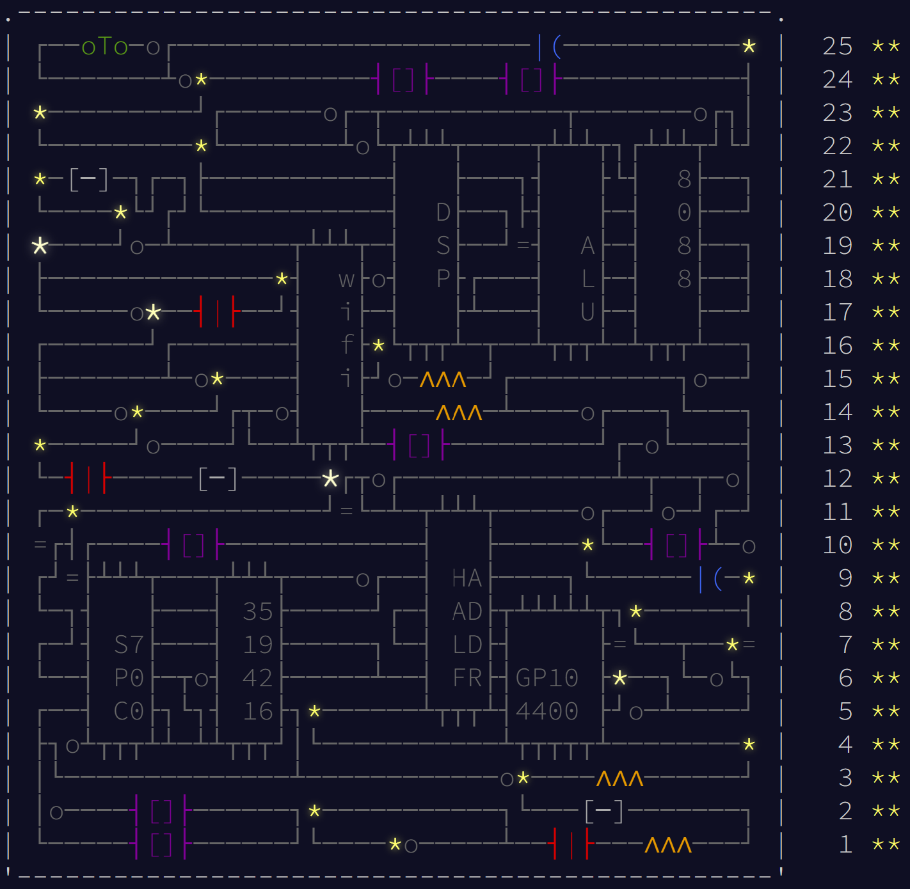

# Advent of Code 2017

  * [Results](#results)

## All Puzzles

* [Day 1: Inverse Captcha](https://adventofcode.com/2017/day/1)
* [Day 2: Corruption Checksum](https://adventofcode.com/2017/day/2)
* [Day 3: Spiral Memory](https://adventofcode.com/2017/day/3)
* [Day 4: High-Entropy Passphrases](https://adventofcode.com/2017/day/4)
* [Day 5: A Maze of Twisty Trampolines, All Alike](https://adventofcode.com/2017/day/5)
* [Day 6: Memory Reallocation](https://adventofcode.com/2017/day/6)
* [Day 7: Recursive Circus](https://adventofcode.com/2017/day/7)
* [Day 8: I Heard You Like Registers](https://adventofcode.com/2017/day/8)
* [Day 9: Stream Processing](https://adventofcode.com/2017/day/9)
* [Day 9: Stream Processing](https://adventofcode.com/2017/day/10)
* [Day 11: Hex Ed](https://adventofcode.com/2017/day/11)
* [Day 12: Digital Plumber](https://adventofcode.com/2017/day/12)
* [Day 13: Packet Scanners](https://adventofcode.com/2017/day/13)
* [Day 14: Disk Defragmentation](https://adventofcode.com/2017/day/14)
* [Day 15: Dueling Generators](https://adventofcode.com/2017/day/15)
* [Day 16: Permutation Promenade](https://adventofcode.com/2017/day/16)
* [Day 17: Spinlock](https://adventofcode.com/2017/day/17)
* [Day 18: Duet](https://adventofcode.com/2017/day/18)
* [Day 19: A Series of Tubes](https://adventofcode.com/2017/day/19)
* [Day 20: Particle Swarm](https://adventofcode.com/2017/day/20)
* [Day 21: Fractal Art](https://adventofcode.com/2017/day/21)
* [Day 22: Sporifica Virus](https://adventofcode.com/2017/day/22)
* [Day 23: Coprocessor Conflagration](https://adventofcode.com/2017/day/23)
* [Day 24: Electromagnetic Moat](https://adventofcode.com/2017/day/24)
* [Day 25: The Halting Problem](https://adventofcode.com/2017/day/25)

## Results

